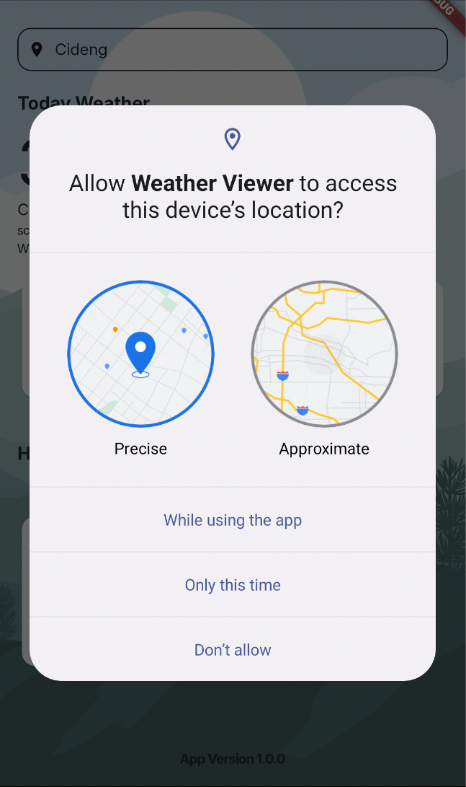

# Simple Weather App - Riverpod, Clean Architecture, MVVM

## Overview
This is a simple Weather App built using **Flutter**, designed with **Riverpod** as the state management solution, and structured using **Clean Architecture** and **MVVM (Model-View-ViewModel)** design principles. The app fetches weather data from the OpenWeather API, providing an example of how to integrate external APIs into a clean and maintainable Flutter application.

### Screenshots




---

## Clean Architecture
**Clean Architecture** is a software design approach that promotes separation of concerns, making the codebase modular, testable, and maintainable. It divides the code into distinct layers:

1. **Presentation Layer**: Handles the UI and user interaction.
2. **Domain Layer**: Contains the business logic and use cases.
3. **Data Layer**: Manages data sources (e.g., APIs, local databases) and repositories.

This separation ensures that each layer has a single responsibility and can be developed and tested independently.

### MVVM Design Pattern
**MVVM (Model-View-ViewModel)** is a design pattern used in conjunction with Clean Architecture. It consists of:

- **Model**: Represents the data and business logic.
- **View**: The UI layer that displays data and handles user interaction.
- **ViewModel**: Acts as a bridge between the View and Model, providing data for the UI and handling user actions.

MVVM ensures that the UI is decoupled from the underlying logic, making it easier to update and test.

---

## Prerequisites
Before you get started, ensure that you have Flutter installed on your system.

### Installing Flutter
1. Download Flutter SDK from the official website: [Flutter Installation Guide](https://docs.flutter.dev/get-started/install).
2. Follow the instructions for your operating system (Windows, macOS, or Linux).
3. Verify your installation by running:
   ```bash
   flutter doctor
   ```
   This command checks for any missing dependencies or configuration issues.

---

## Setting Up the Project

1. **Clone the repository**:
   ```bash
   git clone https://github.com/Lucgudev/Simple-WeateherApp-Riverpod-Clean-MVVM.git
   cd Simple-WeateherApp-Riverpod-Clean-MVVM
   ```

2. **Install dependencies**:
   Run the following command to install all necessary Flutter dependencies:
   ```bash
   flutter pub get
   ```

3. **Create a `.env` file**:
   The app requires an API key to fetch weather data from the OpenWeather API. Create a `.env` file in the root of the project:
   ```bash
   touch .env
   ```
   Add your OpenWeather API key to the `.env` file:
   ```plaintext
   OPENWEATHER_API_KEY=your_api_key_here
   ```
   Replace `your_api_key_here` with your actual API key, which you can obtain by signing up at [OpenWeather](https://openweathermap.org/api).

4. **Run the app**:
   To launch the app on an emulator or physical device, use:
   ```bash
   flutter run
   ```

---

## Folder Structure
This project follows the Clean Architecture structure:

```
lib/
|-- core/             # Contains shared utilities and constants
|-- data/             # Data sources (e.g., API calls, repositories)
|-- domain/           # Business logic and use cases
|-- presentation/     # UI layer (widgets, screens, view models)
|-- main.dart         # Entry point of the application
```

---

## Features
- Fetch and display current weather data.
- Modular and testable code structure.
- State management with Riverpod.
- Clean and maintainable architecture.

---

## Contributing
Feel free to submit issues or contribute to the project by creating pull requests. All contributions are welcome!

---

## License
This project is licensed under the MIT License. See the `LICENSE` file for details.

---

## Contact
For any questions or feedback, feel free to reach out to [Lucgudev](https://github.com/Lucgudev).

